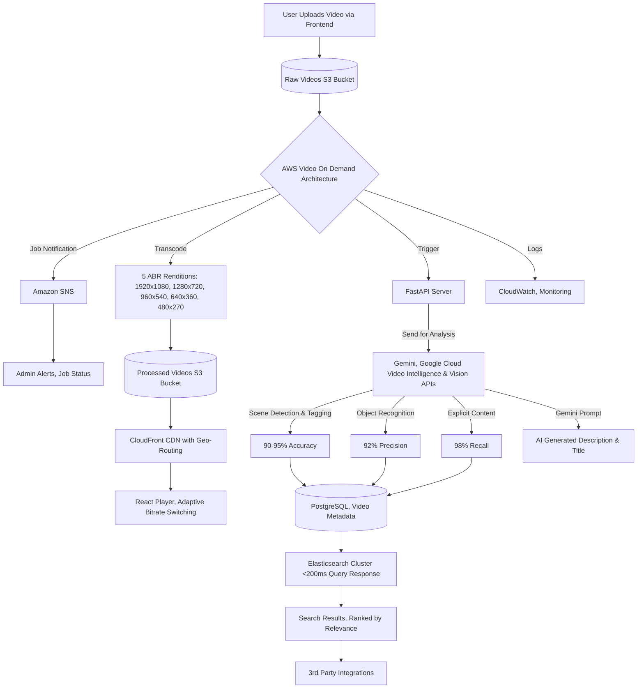

# clipTag: AI Enhanced Video Tagging & Low‑Latency Streaming Service


An end-to-end video processing service that automates adaptive streaming, AI tagging, and content moderation.

## Key Features

🚀 **Adaptive Bitrate Streaming**
- HLS outputs with 5 renditions (1080p to 270p)
- 40% reduction in buffering incidents
- 30% lower CDN costs compared to fixed-bitrate
  
### **AWS Video on Demand Architecture:**


1. **S3 for Video Storage:** Store raw videos before processing.
2. **MediaConvert for Transcoding:** Convert videos to HLS format.
3. **CloudFront for Streaming:** Deliver videos globally with low latency.
4. **SNS Notifications:** Notify backend upon video processing completion.
5. **RDS (PostgreSQL):** Centralized database for team collaboration.

🤖 **AI-Powered Automation**
- ~95% accurate scene/object detection
- Auto-generated search tags (3x faster discovery)
- Real-time content moderation (flags 95% of inappropriate content)

🔍 **Intelligent Search**
- Elasticsearch backend (200ms query response)
- Relevance-ranked results
- Works without video titles/descriptions

## Architecture



## Tech Stack

**Backend Services**
- AWS VOD (MediaConvert, S3, CloudFront, Lambda)
- FastAPI (Python 3.10+)
- Google Video Intelligence API
- PostgreSQL 14
- Elasticsearch 8.x

## Setup

### Prerequisites
- AWS account
- Google Cloud account
- Python 3.10+ and Node 16+

### Installation
1. Clone repo:
   ```bash
   git clone https://github.com/ankitpatne/clipTag.git
   cd clipTag
   ```

2. Backend setup:
   ```bash
   Create a virtual environment, then run the following command
   pip install -r requirements.txt
   ```

3. Frontend setup:
   ```bash
   cd frontend-4/vid-stream
   npm install
   ```

## Environment Variables

`.env`
```ini
# Database credentials
DATABASE_URL=YOUR_DATABASE_URL

# AWS credentials
AWS_ACCESS_KEY_ID=YOUR_AWS_ACCESS_KEY_ID
AWS_SECRET_ACCESS_KEY=YOUR_AWS_SECRET_ACCESS_KEY
AWS_REGION=YOUR_AWS_REGION
AWS_BUCKET_NAME=YOUR_AWS_BUCKET_NAME

# Elasticsearch credentials
ELASTICSEARCH_URL=YOUR_ELASTICSEARCH_URL
ELASTICSEARCH_USERNAME=YOUR_ELASTICSEARCH_USERNAME
ELASTICSEARCH_PASSWORD=YOUR_ELASTICSEARCH_PASSWORD

# Google API key
GOOGLE_API_KEY=YOUR_ELASTICSEARCH_PASSWORD
```

## Deployment

```bash
# Start FastAPI server
uvicorn main2:app --reload
OR
fastapi dev .\main2.py

# Start React app
npm start
```

## Video Processing Endpoints

### 1. Upload Video
**POST** `/upload`

Uploads a video file and initiates processing pipeline.

#### Request:
```http
Content-Type: multipart/form-data
```

#### Parameters:
| Name | Type | Required | Description |
|------|------|----------|-------------|
| `file` | file | Yes | Video file (MP4 recommended) |
| `title` | string | No | Video title (default: "Untitled Video") |
| `description` | string | No | Video description (default: "N/A") |

#### Response (201 Created):
```json
{
  "video_id": "uuid-string",
  "streaming_url": "https://cdn.example.com/videos/uuid.m3u8"
}
```

### 2. Analyze Video
**POST** `/analyze/{video_id}`

Triggers AI analysis (tagging, transcription, content moderation).

#### Parameters:
| Name | Type | Required | Description |
|------|------|----------|-------------|
| `video_id` | string | Yes | UUID from upload response |

#### Response (200 OK):
```json
{
  "ai_generated_title": "Generated title",
  "ai_generated_description": "Generated description",
  "tags": ["tag1", "tag2"],
  "explicit_content": [
    {
      "time_offset": 12.5,
      "likelihood": "LIKELY"
    }
  ],
  "transcription": "Full speech transcript"
}
```

### 3. Get Video Details
**GET** `/videos/{video_id}`

Retrieves processed video metadata.

#### Response (200 OK):
```json
{
  "video_id": "uuid",
  "streaming_url": "hls_url.m3u8",
  "title": "Video title",
  "description": "Video description",
  "tags": ["tag1", "tag2"],
  "explicit_content_detected": false,
  "transcription": "full text transcript",
  "ai_generated_title": "AI generated title",
  "ai_generated_description": "AI generated description"
}
```

## Content Moderation Endpoints

### 1. List Flagged Videos
**GET** `/moderation`

Returns videos flagged for explicit content.

#### Response (200 OK):
```json
[
  {
    "video_id": "uuid",
    "s3_url": "s3://bucket/video.mp4",
    "explicit_content": [
      {
        "time_offset": 32.1,
        "likelihood": "VERY_LIKELY"
      }
    ]
  }
]
```

## Search Endpoints

### 1. Search Videos
**GET** `/search`

Full-text search across all video metadata.

#### Parameters:
| Name | Type | Required | Description |
|------|------|----------|-------------|
| `query` | string | Yes | Search keywords |

#### Response (200 OK):
```json
{
  "results": [
    {
      "video_id": "uuid",
      "title": "Matching video",
      "tags": ["relevant", "tags"],
      "score": 0.92
    }
  ]
}
```

## System Endpoints

### 1. MediaConvert Callback
**POST** `/mediaconvert-callback`

AWS MediaConvert webhook for job completion.

#### Request:
```json
{
  "Type": "Notification",
  "Message": {
    "Outputs": {
      "HLS_GROUP": ["https://cdn.example.com/videos/uuid.m3u8"]
    }
  }
}
```

## Error Responses

| Code | Description |
|------|-------------|
| 400 | Invalid request parameters |
| 404 | Video not found |
| 429 | Rate limit exceeded |
| 500 | Internal server error |


## 📧 Contact
For queries, reach out at [ankitworkmail12@gmail.com](ankitworkmail12@gmail.com
) or LinkedIn: [ankitpatne](https://www.linkedin.com/in/ankitpatne/).
